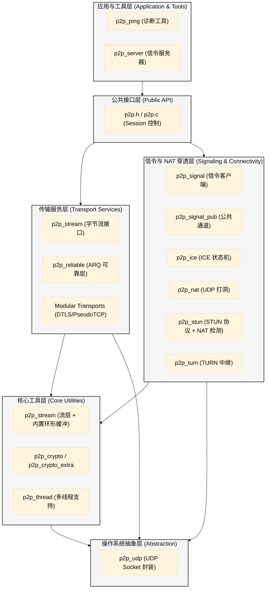

# P2P 项目系统架构文档

本文档详细描述了 P2P 系统的分层架构、模块分组以及各层之间的依赖关系。

## 1. 架构纵览 (Architectural Overview)

本系统采用经典的分层架构模式，旨在实现高内聚、低耦合，并提供灵活的传输协议切换能力。

---

## 2. 分层详细说明

### 2.1 应用与工具层 (Application & Tools)
- **模块**: `p2p_ping`, `p2p_server`
- **职责**: 提供最终用户界面或独立的后端服务。
- **依赖**: 仅依赖公共 API 层。

### 2.2 公共接口层 (Public API)
- **模块**: `p2p.h`, `p2p.c`
- **职责**: 系统入口。管理 `p2p_session` 的生命周期，协调传输层与信令层的协同工作。
- **核心逻辑**: 实现 Transport VTable 的路由分发。

### 2.3 传输服务层 (Transport Services)
- **模块**: `p2p_stream`, `p2p_trans_reliable`, `p2p_trans_pseudotcp`, `p2p_trans_mbedtls`, `p2p_trans_openssl`, `p2p_trans_sctp`
- **职责**: 解决“UDP 不可靠”问题。提供乱序重组、重传计时器、流量控制以及端到端加密。
- **依赖**: 核心工具层（缓冲区管理）和输出抽象层（数据发送）。

### 2.4 信令与 NAT 穿透层 (Signaling & Connectivity)
- **模块**: `p2p_signal`, `p2p_signal_pub`, `p2p_ice`, `p2p_nat`, `p2p_stun`, `p2p_turn`
- **职责**: 解决“由于 NAT 导致的无法连接”问题。
    - **Signaling**: 负责通过中转服务器或公共通道交换 ICE 候选者。
    - **NAT/ICE**: 负责地址发现、打洞握手以及路径最优选择。
- **依赖**: 加密工具层（信令安全）和 UDP 抽象层。

### 2.5 核心工具层 (Core Utilities)
- **模块**: `p2p_stream` (内置环形缓冲), `p2p_crypto`, `p2p_thread`
- **职责**: 提供跨模块的通用能力。流层内置环形缓冲区用于字节流读写，Crypto 提供基础加解密，Thread 提供多线程轮询驱动。

### 2.6 操作系统抽象层 (Abstraction)
- **模块**: `p2p_udp`
- **职责**: 将复杂的系统级 Socket 操作简化为统一的非阻塞接口。支持跨平台扩展。

---

## 3. 核心依赖原则 (Dependency Rules)

1.  **自上而下**: 高层模块可以调用低层模块，但禁止反向调用（低层通过 Callback/Event 通知高层）。
2.  **模块隔离**: 传输层模块不应直接了解信令层的内部实现（例如 `p2p_reliable` 不应感知自己是在走 GitHub 还是 TCP Server 信号）。
3.  **资源单向共享**: 所有资源申请（内存/Socket）尽可能在 `p2p.c` 层级管理，低层模块仅作为 Context 提供者执行计算。

---

**文档生成人**: Antigravity  
**最后更新**: 2026-02-13
