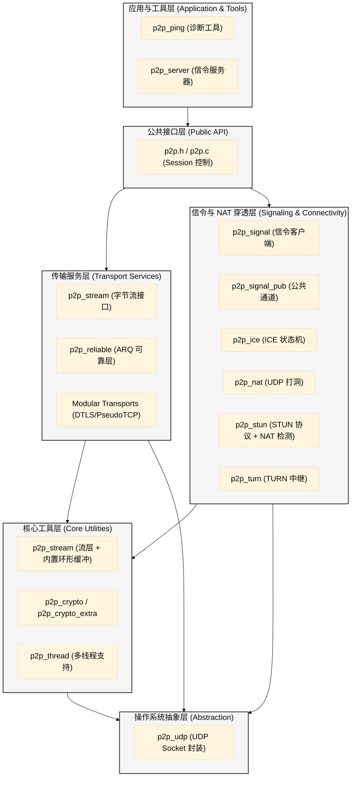

# P2P 项目系统架构文档

本文档详细描述了 P2P 系统的分层架构、模块分组以及各层之间的依赖关系。

## 1. 架构纵览 (Architectural Overview)

本系统采用经典的分层架构模式，旨在实现高内聚、低耦合，并提供灵活的传输协议切换能力。



---

## 2. 分层详细说明

### 2.1 应用与工具层 (Application & Tools)
- **模块**: `p2p_ping`, `p2p_server`
- **职责**: 提供最终用户界面或独立的后端服务。
- **依赖**: 仅依赖公共 API 层。

### 2.2 公共接口层 (Public API)
- **模块**: `p2p.h`, `p2p.c`
- **职责**: 系统入口。管理 `p2p_session` 的生命周期，协调传输层与信令层的协同工作。
- **核心逻辑**: 实现 Transport VTable 的路由分发。

### 2.3 传输服务层 (Transport Services)
- **模块**: `p2p_stream`, `p2p_trans_reliable`, `p2p_trans_pseudotcp`, `p2p_trans_mbedtls`, `p2p_trans_openssl`, `p2p_trans_sctp`
- **职责**: 解决“UDP 不可靠”问题。提供乱序重组、重传计时器、流量控制以及端到端加密。
- **依赖**: 核心工具层（缓冲区管理）和输出抽象层（数据发送）。

### 2.4 信令与 NAT 穿透层 (Signaling & Connectivity)
- **模块**: `p2p_signal`, `p2p_signal_pub`, `p2p_ice`, `p2p_nat`, `p2p_stun`, `p2p_turn`
- **职责**: 解决“由于 NAT 导致的无法连接”问题。
    - **Signaling**: 负责通过中转服务器或公共通道交换 ICE 候选者。
    - **NAT/ICE**: 负责地址发现、打洞握手以及路径最优选择。
- **依赖**: 加密工具层（信令安全）和 UDP 抽象层。

### 2.5 核心工具层 (Core Utilities)
- **模块**: `p2p_stream` (内置环形缓冲), `p2p_crypto`, `p2p_thread`
- **职责**: 提供跨模块的通用能力。流层内置环形缓冲区用于字节流读写，Crypto 提供基础加解密，Thread 提供多线程轮询驱动。

### 2.6 操作系统抽象层 (Abstraction)
- **模块**: `p2p_udp`
- **职责**: 将复杂的系统级 Socket 操作简化为统一的非阻塞接口。支持跨平台扩展。

---

## 3. 信令模式对比 (Signaling Modes Comparison)

系统支持三种信令模式，满足不同的部署场景和需求：

### 3.1 模式对比表

| 特性         | Relay 模式                | Compact 模式              | PubSub 模式           |
|--------------|---------------------------|---------------------------|-----------------------|
| 传输层       | TCP 长连接                | UDP 无连接                | HTTPS (GitHub API)    |
| 服务器       | 自建 p2p_server           | 自建 UDP 信令服务器       | GitHub Gist           |
| 实时性       | 高（推送模式）            | 高（推送模式）            | 低（轮询模式）        |
| 离线缓存     | 支持（单候选，最大256）   | 支持（整包，可配置）      | Gist 持久化（天然支持异步）|
| 可靠性       | TCP 保证                  | 需应用层确认/重传         | HTTP 保证             |
| 部署复杂度   | 需自建服务器              | 需自建服务器              | 无需服务器            |
| 加密         | 可选 TLS 或应用层         | 应用层加密                | 内置 DES 加密         |
| 适用场景     | 企业内网、稳定连接        | 移动网络、弱网环境        | 快速原型、演示        |

### 3.2 Relay 模式 (TCP)

**模块**: `p2p_signal_relay.c/h`

**特点**:
- 基于 TCP 长连接，保证消息顺序和可靠性
- 服务器维护在线用户列表和状态
- 离线候选缓存（单候选粒度，最大 256 个/用户）
- 支持完整的 Trickle ICE 增量候选交换
- 对端上线推送通知（P2P_RLY_OFFER）
- 细粒度确认机制（candidates_acked）

**核心流程**:
1. 客户端通过 TCP 连接到信令服务器
2. 发送 LOGIN 注册身份
3. 发送 CONNECT 携带 ICE 候选
4. 服务器根据对端状态：
   - 在线：转发为 OFFER（实时推送）
   - 离线：缓存候选，等待对端上线后推送
5. 支持 Trickle ICE：候选收集过程中即时发送

**优势**:
- TCP 保证可靠性，无需应用层重传
- 适合企业内网环境（可控服务器）
- 离线缓存支持异步通信场景

**劣势**:
- 需要自建服务器
- TCP 握手延迟高于 UDP

### 3.3 Compact 模式 (UDP)

**模块**: `p2p_signal_compact.c/h`

**特点**:
- 基于 UDP 无连接协议
- 紧凑集成：信令交换 + NAT 端口检测 + 候选交换 + 数据中继
- 支持 NAT 类型探测（双端口方案）
- 序列化候选同步机制（PEER_INFO + ACK）
- 可选的中继降级（打洞失败时）

**核心流程**:
1. 客户端向 UDP 服务器发送 REGISTER
2. 服务器返回 REGISTER_ACK（公网地址、探测端口、对端状态）
3. 可选：NAT 类型探测（向探测端口发送 NAT_PROBE）
4. 双方通过 PEER_INFO 序列化交换候选
5. 应用层 ACK 确认机制保证可靠性

**优势**:
- 低延迟（无 TCP 握手）
- 适合移动网络和弱网环境
- NAT 探测功能辅助连接策略选择

**劣势**:
- 需要实现应用层重传逻辑
- 需要自建服务器

### 3.4 PubSub 模式 (HTTPS)

**模块**: `p2p_signal_pubsub.c/h`

**特点**:
- 基于 GitHub Gist 作为信令通道，无需自建服务器
- 非对称角色: **PUB（发起端）** 写 offer / 读 answer，**SUB（订阅端）** 读 offer / 写 answer
- 内置 DES + Base64 加密，密钥来自 `p2p_config_t.auth_key`
- ETag 条件轮询（If-None-Match），304 节省流量
- PUB/SUB 轮询间隔独立可配: `P2P_PUBSUB_PUB_POLL_MS`（1s）/ `P2P_PUBSUB_SUB_POLL_MS`（5s）
- Gist 持久化，天然支持双方异步上线场景

**核心流程**:
1. PUB 调用 `p2p_signal_pubsub_send()` 将加密 ICE 候选写入 Gist `offer` 字段
2. SUB 每 `P2P_PUBSUB_SUB_POLL_MS`（5s）轮询 Gist，检测 `offer` 更新
3. SUB 解密 offer，注入本地 ICE 候选，自动回写 `answer`（仅一次）
4. PUB 每 `P2P_PUBSUB_PUB_POLL_MS`（1s）轮询 Gist，尽快检测 `answer` 更新
5. PUB 解密 answer，双方开始 ICE 连通性检查

**优势**:
- 零部署成本（利用 GitHub 基础设施）
- 快速上手，适合演示和测试
- 数据持久化，支持异步场景（双方无需同时在线）

**劣势**:
- 轮询模式，建连延迟受轮询间隔影响（典型总延迟 ≤6s）
- 依赖 GitHub 服务可用性和 API 速率限制
- DES 加密强度低，生产环境应替换为 AES-256-GCM

### 3.5 选型建议

**选择 Relay 模式**，当：
- 需要可靠的实时推送
- 对端可能离线（支持缓存）
- 有自建服务器条件
- 企业内网环境

**选择 Compact 模式**，当：
- 追求低延迟
- 移动网络或弱网环境
- 需要 NAT 类型探测
- 有自建服务器条件

**选择 PubSub 模式**，当：
- 快速原型开发
- 无服务器部署条件
- 演示或测试场景
- 可接受轮询延迟（建连 ≤6s）
- 双方可能异步上线（Gist 持久化）

---

## 4. 核心依赖原则 (Dependency Rules)

1.  **自上而下**: 高层模块可以调用低层模块，但禁止反向调用（低层通过 Callback/Event 通知高层）。
2.  **模块隔离**: 传输层模块不应直接了解信令层的内部实现（例如 `p2p_reliable` 不应感知自己是在走 GitHub 还是 TCP Server 信号）。
3.  **资源单向共享**: 所有资源申请（内存/Socket）尽可能在 `p2p.c` 层级管理，低层模块仅作为 Context 提供者执行计算。

---

## 5. 设计讨论：候选状态追踪

### 5.1 当前实现（基于索引追踪）

**设计**：
- 使用全局索引 `next_candidate_index` 追踪发送进度
- 服务器返回 `candidates_acked` 表示"前 N 个候选成功"
- 客户端通过 `next_candidate_index += candidates_acked` 更新

**隐式假设**：
- 服务器**按顺序**缓存候选（从 `i=0` 开始循环）
- `candidates_acked=5` 表示候选 `[0, 1, 2, 3, 4]` 成功
- 未确认的候选会在下次重发

**验证正确性**：
```
发送候选 [0-7] (8个)
服务器只缓存 [0-4] (5个)，返回 acked=5

客户端：next_candidate_index = 0 + 5 = 5
下次发送：候选 [5-12]

候选 5, 6, 7 在第一批中未被确认，下次会重发 ✅ 正确
```

**优势**：
- ✅ 简单高效（仅需一个索引变量）
- ✅ 协议开销小（仅 1 字节 `candidates_acked`）
- ✅ 服务器实现简单（顺序循环）

**劣势**：
- ⚠️ 依赖服务器行为假设（脆弱性）
- ⚠️ 无法区分"未发送"和"发送失败"
- ⚠️ 无法支持乱序确认（如优先级候选）

### 5.2 未来改进方向（候选独立状态机）

**设计目标**：
- 每个候选独立追踪状态（PENDING/SENDING/ACKED/FAILED）
- 协议明确返回"哪些候选成功"（位图或索引列表）
- 支持选择性重传（仅重发失败的候选）

**候选状态定义**：
```c
typedef enum {
    CAND_STATE_PENDING = 0,   // 待发送（新收集到）
    CAND_STATE_SENDING,       // 发送中（等待 ACK）
    CAND_STATE_ACKED,         // 已确认（服务器成功缓存/转发）
    CAND_STATE_FAILED         // 发送失败（需要重试）
} candidate_send_state_t;

typedef struct {
    p2p_candidate_t candidate;
    candidate_send_state_t state;
    uint8_t retry_count;      // 重试次数（避免无限重试）
    uint64_t last_send_time;  // 最后发送时间（超时检测）
} tracked_candidate_t;
```

**协议扩展选项**：

**Option A**：返回位图（紧凑，适合小批量）
```c
typedef struct {
    uint8_t  status;
    uint8_t  candidates_cached;     // 客户端发送数量（校验用）
    uint32_t ack_bitmap;          // 位图：bit[i]=1 表示候选 i 成功
    uint8_t  reserved;
} p2p_relay_connect_ack_t;  // 7 字节
```

**Option B**：返回索引列表（精确，适合大批量）
```c
typedef struct {
    uint8_t status;
    uint8_t candidates_acked;    // 成功的候选数量
    uint8_t acked_indices[8];    // 成功的候选索引列表
} p2p_relay_connect_ack_t;  // 10 字节
```

**Option C**：返回范围（简单，适合顺序场景）
```c
typedef struct {
    uint8_t status;
    uint8_t cache_start_index;   // 缓存起始索引（相对本批）
    uint8_t cache_count;          // 连续缓存数量
    uint8_t reserved;
} p2p_relay_connect_ack_t;  // 4 字节（当前大小）
```

**权衡分析**：

| 方案 | 优势 | 劣势 | 适用场景 |
|------|------|------|---------|
| **当前方案（索引追踪）** | 简单、协议开销小 | 依赖隐式假设 | 顺序缓存、小规模部署 ✅ |
| **Option A（位图）** | 支持乱序确认 | 限制批量大小（32个） | 需要优先级候选 |
| **Option B（索引列表）** | 精确、灵活 | 协议开销大 | 高可靠性要求 |
| **Option C（范围）** | 保持简单 | 仅支持连续范围 | 当前场景的增强版 |

**建议**：
- 当前实现**已验证正确**，适合现有场景（顺序缓存、批量≤8）
- 如需支持以下场景再考虑升级：
  - 乱序确认（优先级候选）
  - 大批量发送（>8 个）
  - 跨服务器候选同步（需要精确状态）

### 5.3 Trickle ICE 批量大小的设计权衡

**问题**：每次应该发送多少个候选？

**理论最优**：
- **1 个/批次**：真正的 Trickle ICE（最低延迟）
- **N 个/批次**：批量发送（减少包数量）

**当前实现**：`MAX_CANDIDATES_PER_BATCH = 8`

**设计理由**：
1. **正常 Trickle ICE**：
   - 收集 1-2 个就发送（实时性优先）
   - 发送间隔由收集速度决定（通常 100-500ms）

2. **失败重传**：
   - 批量发送最多 8 个（效率优先）
   - 避免单个 TCP 包过大（8 个候选 ≈ 300 字节）

3. **网络优化**：
   - TCP Nagle 算法会自动合并小包
   - 8 个候选平衡了延迟和带宽

**参数调优建议**：
- **低延迟场景**（WebRTC 视频通话）：`MAX = 1-2`
- **弱网环境**（移动网络）：`MAX = 4-8`
- **批量同步**（对端离线缓存）：`MAX = 16-32`

---

**文档生成人**: Antigravity  
**最后更新**: 2026-02-18
